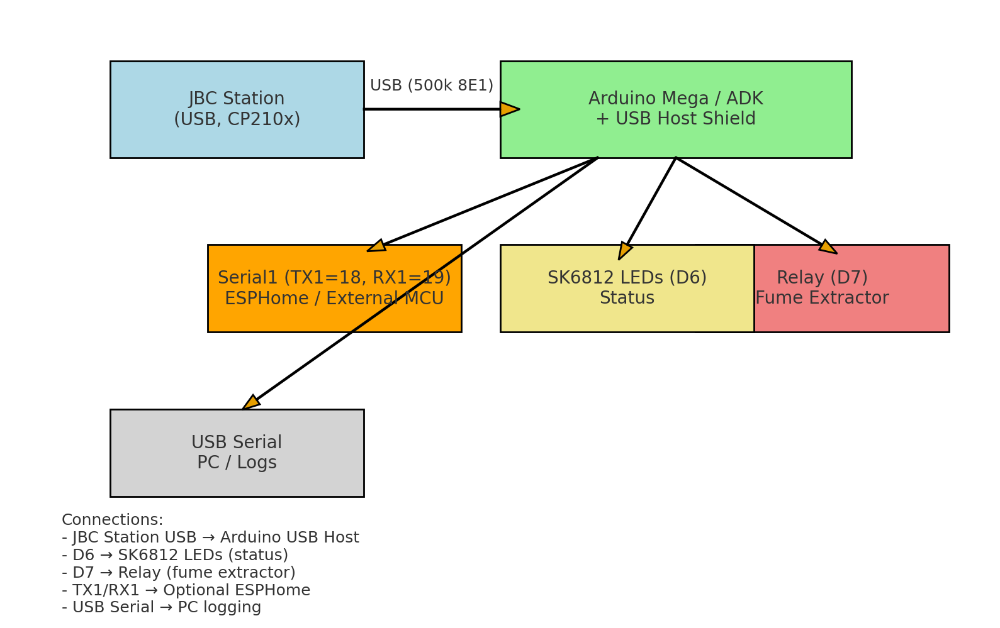

# JBC Link (CP210x USB ↔ Arduino) – P02/P01 Auto

**Passive USB bridge for JBC soldering and hot air stations (CP210x, P01/P02 auto-detect, Conti-Mode relay + LED).**

The bridge transparently monitors the station communication, automatically detects the protocol (**P01 or P02**) and exposes the data via console and UART.  

---


## Wiring Diagram

<p align="center">
  
</p>

<sub>SVG version available at <code>jbc_link_wiring.svg</code>.</sub>

---

## Features

- **Strictly passive**: no TX before the first valid frame/handshake  
- **Automatic protocol detection** (P01/P02)  
- **Conti-Mode**: detects continuous extraction mode and drives **relay (D7)** + **SK6812 LEDs (D6)**  
- **Keep-Alive & watchdog** for stable link  
- **Hotplug detection** for USB attach/detach events  
- **Dual console**: simultaneous output via USB Serial and Serial1  
- **Supports** soldering stations (e.g. **DDE**) and hot air stations (e.g. **JTSE**)  
- **CLI** for status, logs and debugging  

---

## Purpose

- **Integration & Automation**  
  - Forward station data to external systems such as ESPHome or Home Assistant  
- **Conti-Mode outputs**  
  - Relay (D7) to directly control a **fume extractor or filter**  
  - SK6812 LEDs (D6) for **visual status indication**  
- **Debugging & Analysis**  
  - Cleartext decoder and log output of all station communication  

---

## CLI

The bridge provides a command line interface for status queries, log toggling and debug options.  

### Examples
```text
HELP                 # Show all available commands
STATE                # Show current link/protocol state
LOG ON | LOG OFF     # Enable/disable protocol logging
HEX ON | HEX OFF     # Enable/disable hex frame dump
SYN ON | SYN OFF     # Show/hide keep-alive frames
FID ON | FID OFF     # Show/hide frame IDs in logs
USBCLI ON | OFF      # Allow/deny TX from USB console

Example JBC Commands
M_INF_PORT 0
M_R_DEVICEIDORIGINAL
M_R_SLEEPTEMP 0 2
M_R_FIRMWARE
M_R_STATERROR
All JBC Commands find in jbc_console_map.h
